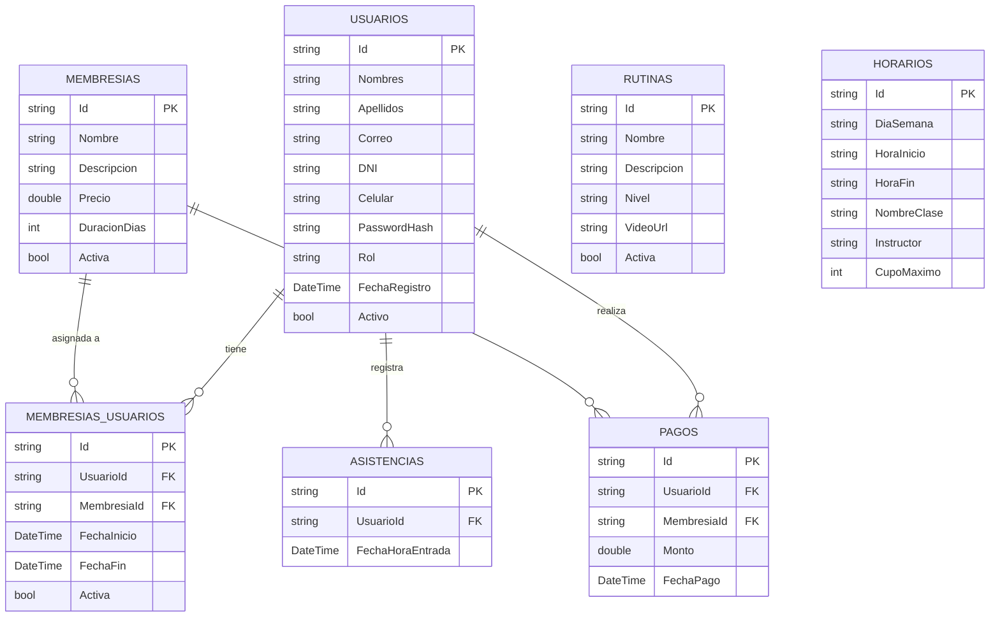
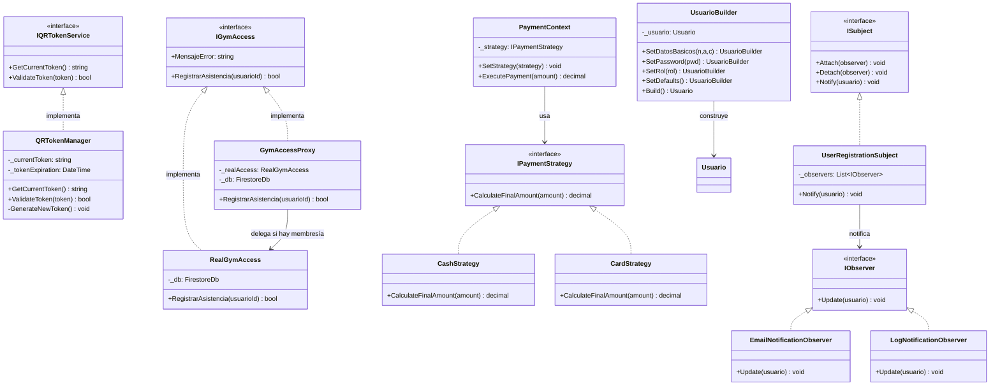
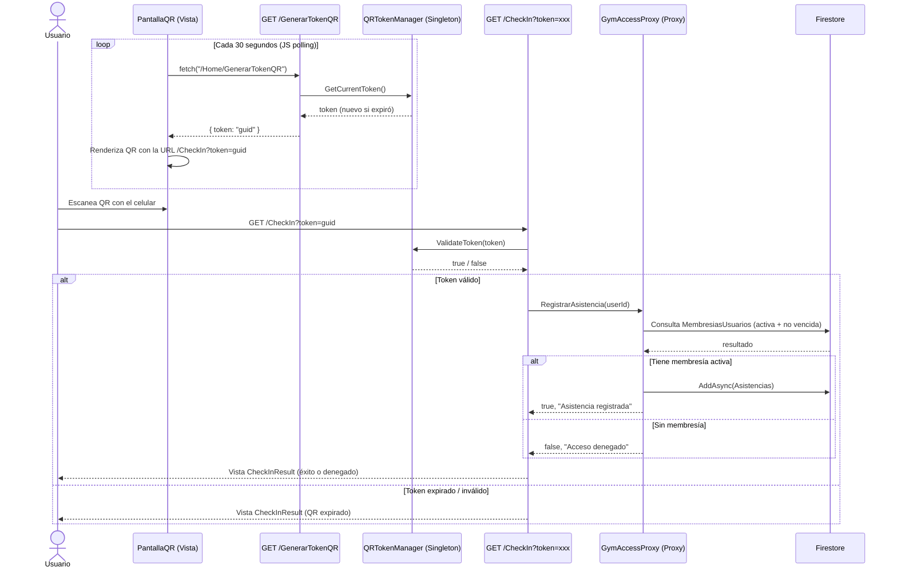
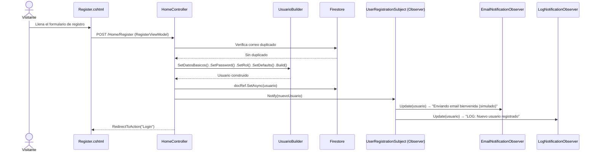
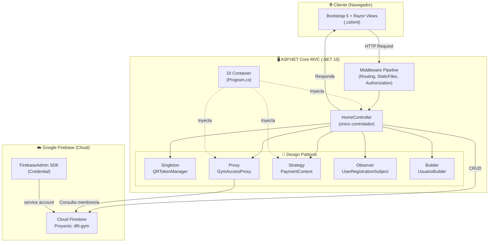

# 🏋️ Análisis Técnico Completo — DFIT Power

> Sistema de gestión para gimnasios. Web App construida con ASP.NET Core MVC + Google Firestore.

---

## 1. Stack Tecnológico y Frameworks

| Capa | Tecnología | Versión |
|---|---|---|
| **Lenguaje** | C# | .NET 10.0 |
| **Framework Web** | ASP.NET Core MVC | 10.0 |
| **Base de Datos** | Google Cloud Firestore | SDK 4.3.0 |
| **SDK Firebase** | FirebaseAdmin | 3.5.0 |
| **ORM (legado)** | Entity Framework Core SqlServer | 8.0.0 (paquete presente pero NO usado activamente — migrado a Firestore) |
| **Frontend** | Razor Views (.cshtml) + Bootstrap 5 + jQuery | — |
| **Estilos** | CSS propio (`site.css`) + Bootstrap 5 | — |
| **Contenedorización** | Docker (imagen `dotnet/aspnet:8.0`) | — |
| **Autenticación QR** | Sistema propio con tokens GUID + expiración 1 min | — |

> [!WARNING]
> El `.csproj` declara target `net10.0` pero el `Dockerfile` usa imagen `dotnet/aspnet:8.0`. Esto puede causar incompatibilidades al construir el contenedor.

> [!NOTE]
> EF Core SqlServer aparece en el `.csproj` como dependencia residual de una migración anterior a Firestore. No se usa en el código activo — la línea `AddDbContext` está comentada en `Program.cs`.

---

## 2. Estructura de Carpetas

```
Dfit/
├── Controllers/
│   └── HomeController.cs          ← Único controlador (795 líneas, todas las rutas)
│
├── Models/
│   ├── Asistencia.cs
│   ├── EditUserViewModel.cs
│   ├── ErrorViewModel.cs
│   ├── Horario.cs
│   ├── LoginViewModel.cs
│   ├── Membresia.cs
│   ├── MembresiaUsuario.cs
│   ├── Pago.cs
│   ├── ProfileViewModel.cs
│   ├── RegisterViewModel.cs
│   ├── Rutina.cs
│   ├── Usuario.cs
│   └── Patterns/
│       ├── Builder/
│       │   └── UsuarioBuilder.cs        ← Construcción fluida de Usuario
│       ├── Observer/
│       │   └── UserRegistrationObserver.cs  ← Notificaciones al registrar
│       ├── Proxy/
│       │   └── GymAccessProxy.cs        ← Control de acceso al gym (QR)
│       ├── Singleton/
│       │   └── QRTokenManager.cs        ← Token QR único global
│       └── Strategy/
│           └── PaymentStrategy.cs       ← Estrategia de pago (Efectivo/Tarjeta)
│
├── Views/
│   ├── Home/                          ← 25 vistas Razor
│   │   ├── Login.cshtml
│   │   ├── Register.cshtml
│   │   ├── Dashboard.cshtml
│   │   ├── Profile.cshtml
│   │   ├── CreateUser.cshtml / EditUser.cshtml
│   │   ├── Membresias.cshtml / CreateMembresia.cshtml / EditMembresia.cshtml
│   │   ├── AssignMembresia.cshtml / MiMembresia.cshtml
│   │   ├── RegistrarPago.cshtml / PagosUsuario.cshtml / ReporteFinanciero.cshtml
│   │   ├── Asistencia.cshtml / CheckInResult.cshtml / PantallaQR.cshtml
│   │   ├── Rutinas.cshtml / CreateRutina.cshtml / EditRutina.cshtml
│   │   └── Horarios.cshtml / CreateHorario.cshtml / EditHorario.cshtml
│   └── Shared/
│       ├── _Layout.cshtml             ← Layout con sidebar de navegación
│       └── Error.cshtml
│
├── wwwroot/
│   ├── css/site.css
│   ├── images/logo.png
│   ├── js/site.js
│   └── lib/                           ← Bootstrap 5 + jQuery (librerías del lado del cliente)
│
├── Program.cs                         ← Entry point, DI Container, configuración Firebase
├── Dfit.csproj                        ← Dependencias NuGet
├── appsettings.json                   ← Config de logging + conn string legada
├── firebase-key.json                  ← Credenciales de service account de Firebase (⚠️ en repo)
└── Dockerfile                         ← Imagen Docker para despliegue
```

> [!CAUTION]
> El archivo `firebase-key.json` está dentro del repositorio y se copia al contenedor Docker. Esto es una **vulnerabilidad de seguridad grave** — las credenciales de Firebase nunca deben estar en el código fuente. Se recomienda usar variables de entorno o Secret Manager.

---

## 3. Modelo de Datos (Colecciones Firestore)

El proyecto NO usa una base de datos relacional. Todas las entidades son **colecciones de documentos en Firestore** (NoSQL).

### 3.1 Diagrama de Entidades



> [!NOTE]
> Al ser Firestore (NoSQL), las relaciones entre colecciones se manejan mediante IDs referenciados manualmente (no hay foreign keys reales). Los datos relacionados se obtienen con múltiples lecturas adicionales en el controlador.

### 3.2 Resumen de Colecciones

| Colección | Propósito | Campos clave |
|---|---|---|
| `Usuarios` | Miembros y admins del gym | Correo, Rol, Activo, PasswordHash |
| `Membresias` | Planes disponibles (mensual, trimestral, etc.) | Precio, DuracionDias, Activa |
| `MembresiasUsuarios` | Asignación de plan a un usuario | FechaFin, Activa (pivot) |
| `Pagos` | Registro de pagos realizados | Monto, FechaPago |
| `Asistencias` | Check-in de entrada al gym | FechaHoraEntrada |
| `Rutinas` | Planes de entrenamiento con video | Nivel, VideoUrl |
| `Horarios` | Clases grupales semanales | DiaSemana, HoraInicio, Instructor |

---

## 4. Endpoints / Rutas de la Aplicación

Patrón de ruta base: `{controller=Home}/{action=Login}/{id?}`

### 4.1 Autenticación

| Método | Ruta | Descripción |
|---|---|---|
| GET | `/Home/Login` | Formulario de inicio de sesión |
| POST | `/Home/Login` | Autenticar usuario contra Firestore |
| GET | `/Home/Register` | Formulario de registro |
| POST | `/Home/Register` | Crear nuevo usuario (usa Builder + Observer) |

### 4.2 Gestión de Usuarios (Admin)

| Método | Ruta | Descripción |
|---|---|---|
| GET | `/Home/Dashboard` | Lista de todos los usuarios + filtro de búsqueda |
| GET | `/Home/CreateUser` | Formulario crear usuario |
| POST | `/Home/CreateUser` | Guardar nuevo usuario |
| GET | `/Home/EditUser/{id}` | Formulario editar usuario |
| POST | `/Home/EditUser` | Actualizar datos de usuario |
| POST | `/Home/DeleteUser` | Eliminar usuario de Firestore |
| POST | `/Home/ToggleUserStatus` | Activar/Desactivar cuenta de usuario |
| GET | `/Home/Profile/{id}` | Ver perfil de usuario |
| POST | `/Home/Profile` | Actualizar nombre, correo y/o contraseña |

### 4.3 Membresías

| Método | Ruta | Descripción |
|---|---|---|
| GET | `/Home/Membresias` | Lista de planes de membresía |
| GET | `/Home/CreateMembresia` | Formulario nueva membresía |
| POST | `/Home/CreateMembresia` | Guardar nueva membresía |
| GET | `/Home/EditMembresia/{id}` | Formulario editar membresía |
| POST | `/Home/EditMembresia` | Actualizar membresía |
| POST | `/Home/DeleteMembresia` | Eliminar membresía |
| GET | `/Home/AssignMembresia?usuarioId={id}` | Seleccionar plan para asignar a usuario |
| POST | `/Home/AssignMembresia` | Crear registro `MembresiasUsuarios` |
| GET | `/Home/MiMembresia/{id}` | Ver membresía activa del usuario |
| POST | `/Home/CancelMembresia` | Usuario cancela su membresía |
| POST | `/Home/AdminRemoveMembresia` | Admin remueve membresía de usuario |

### 4.4 Pagos y Reportes

| Método | Ruta | Descripción |
|---|---|---|
| GET | `/Home/RegistrarPago?usuarioId={id}` | Formulario de pago |
| POST | `/Home/RegistrarPago` | Procesar pago (aplica Strategy: Efectivo/Tarjeta) |
| GET | `/Home/PagosUsuario/{id}` | Historial de pagos de un usuario |
| GET | `/Home/ReporteFinanciero` | Reporte global: ingresos totales y del mes |

### 4.5 Control de Asistencia

| Método | Ruta | Descripción |
|---|---|---|
| GET | `/Home/Asistencia` | Panel de asistencia del día actual |
| POST | `/Home/RegistrarAsistencia` | Registrar entrada manual (verifica membresía activa) |
| GET | `/Home/PantallaQR` | Pantalla con código QR en tiempo real |
| GET | `/Home/GenerarTokenQR` | API JSON que devuelve el token QR actual |
| GET | `/Home/CheckIn?token={token}` | Validar QR y registrar asistencia (usa Proxy + Singleton) |

### 4.6 Rutinas y Horarios

| Método | Ruta | Descripción |
|---|---|---|
| GET | `/Home/Rutinas` | Lista de rutinas activas |
| GET | `/Home/CreateRutina` | Formulario nueva rutina |
| POST | `/Home/CreateRutina` | Guardar rutina |
| GET | `/Home/EditRutina/{id}` | Formulario editar rutina |
| POST | `/Home/EditRutina` | Actualizar rutina |
| POST | `/Home/DeleteRutina` | Desactivar rutina (soft delete) |
| GET | `/Home/Horarios` | Lista de horarios semanales |
| GET | `/Home/CreateHorario` | Formulario nuevo horario |
| POST | `/Home/CreateHorario` | Guardar horario |
| GET | `/Home/EditHorario/{id}` | Formulario editar horario |
| POST | `/Home/EditHorario` | Actualizar horario |
| POST | `/Home/DeleteHorario` | Eliminar horario |

---

## 5. Patrones de Diseño Implementados



### Resumen de Patrones

| Patrón | Clase | Propósito en DFIT |
|---|---|---|
| **Singleton** | `QRTokenManager` | Un único token QR activo para toda la app, se regenera cada 60 segundos |
| **Proxy** | `GymAccessProxy` → `RealGymAccess` | Intercepta el registro de asistencia y verifica membresía activa antes de permitir el acceso |
| **Strategy** | `CashStrategy` / `CardStrategy` | Permite cambiar la lógica de cálculo de pago (efectivo sin recargo, tarjeta +5%) en tiempo de ejecución |
| **Observer** | `UserRegistrationSubject` → `EmailNotificationObserver` + `LogNotificationObserver` | Al registrar un usuario, notifica automáticamente a múltiples sistemas (simulado: email y log) |
| **Builder** | `UsuarioBuilder` | Construye un objeto `Usuario` de forma fluida y legible, evitando constructores con muchos parámetros |

---

## 6. Diagrama de Comunicación — Flujo de Check-in por QR



---

## 7. Diagrama de Comunicación — Registro de Usuario



---

## 8. Diagrama de Arquitectura General



---

## 9. Configuración de Entorno y Requerimientos

### 9.1 Variables / Archivos de Configuración

| Archivo | Propósito |
|---|---|
| `appsettings.json` | Logging + connection string SQL (legada, no activa) |
| `appsettings.Development.json` | Overrides para desarrollo local |
| `firebase-key.json` | Credenciales del Service Account de Google/Firebase |

### 9.2 Variable de Entorno en Docker

```bash
PORT=8080
ASPNETCORE_URLS=http://+:${PORT}
GOOGLE_APPLICATION_CREDENTIALS=/app/firebase-key.json  # Se establece en Program.cs
```

### 9.3 Requerimientos para Ejecutar Localmente

1. **.NET SDK 10.0** instalado
2. Archivo `firebase-key.json` válido en la raíz del proyecto
3. Proyecto Firebase `dfit-gym` creado con Firestore habilitado
4. Comando: `dotnet run` desde la carpeta `Dfit/`

### 9.4 Requerimientos para Docker

```bash
docker build -t dfit .
docker run -p 8080:8080 dfit
```

> [!WARNING]
> El Dockerfile usa `dotnet/aspnet:8.0` pero el proyecto apunta a `net10.0`. Para producción se debe cambiar a `dotnet/aspnet:10.0` o ajustar el target framework.

---

## 10. Dependencias NuGet (`.csproj`)

| Paquete | Versión | Uso |
|---|---|---|
| `FirebaseAdmin` | 3.5.0 | Inicialización de Firebase App, autenticación con Google Credentials |
| `Google.Cloud.Firestore` | 4.3.0 | Cliente Firestore: lectura/escritura de documentos |
| `Microsoft.EntityFrameworkCore.SqlServer` | 8.0.0 | ⚠️ Legado — no activo |
| `Microsoft.EntityFrameworkCore.Design` | 8.0.0 | ⚠️ Legado — no activo |
| `Microsoft.EntityFrameworkCore.Tools` | 8.0.0 | ⚠️ Legado — no activo |

### Frontend (wwwroot/lib — librerías de cliente)

- **Bootstrap 5** — Grid, componentes UI, formularios
- **jQuery** — Manipulación DOM, AJAX requests (polling QR)

---

## 11. Observaciones y Puntos de Mejora

| # | Observación | Severidad |
|---|---|---|
| 1 | `firebase-key.json` commiteado al repo — riesgo de exposición de credenciales | 🔴 Crítico |
| 2 | Contraseñas almacenadas en texto plano (`PasswordHash` es solo texto) — no hay hashing real | 🔴 Crítico |
| 3 | No hay autenticación de sesión real (cookies/JWT) — `HttpContext.Session` solo se usa en `CheckIn` pero no en otras rutas | 🟠 Alto |
| 4 | Un solo controlador de 795 líneas — viola Single Responsibility y dificulta el mantenimiento | 🟡 Medio |
| 5 | EF Core + SQL Server declarado como dependencia pero sin uso — limpiar el `.csproj` | 🟡 Medio |
| 6 | Incompatibilidad `net10.0` vs imagen Docker `aspnet:8.0` | 🟠 Alto |
| 7 | Múltiples lecturas secuenciales a Firestore por entidad (sin batch queries ni caché) — rendimiento degradado con muchos documentos | 🟡 Medio |
| 8 | `GymAccessProxy` usa `.Result` en métodos async — riesgo de deadlock | 🟠 Alto |
